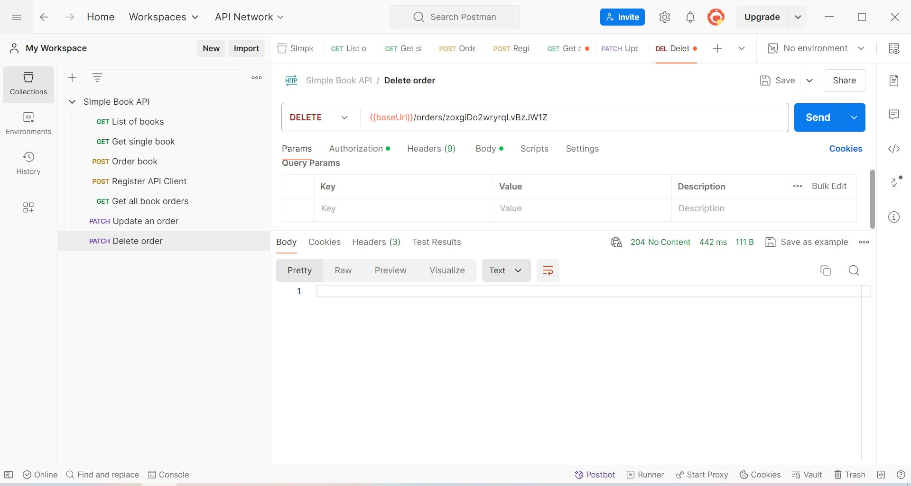

<h1>Testing API With Postman</h1>
<p align="center">
  <a href="https://www.postman.com/">
    
  </a>
</p>

## Simple Book API 
- This API allows you to reserve a book.
- Địa chỉ API mà trong báo cáo này sử dụng là: `https://simple-books-api.glitch.me`
- Việc thực hiện kiểm thử tự động với Postman được ghi chép chi tiết ở trong file `autoTestPostman.md` ở trong dự án này.
### Cài đặt biến baseUrl 
Biến này được sử dụng để làm đơn giản đường dẫn url, bên dưới là ảnh cho thiết lập này.

### Phương thức GET

Thực hiện kiểm tra với phương thức GET `/books`, sẽ thực hiện trả về danh sách các cuốn sách. Các tham số truy vấn tùy chọn:
- type: fiction or non-fiction.
- limit: một số nằm trong khoảng từ 1 đến 20.


  
- Sử dụng phương thức GET để nhận một quyển sách theo ID. Ảnh thực hiện:


### Phương thức POST
Cho phép bạn gửi một đơn đặt hàng mới. Yêu cầu xác thực.
Để thực hiện tạo một đơn đặt hàng mới, phải thực hiện xác thực các bước lần lượt là:
- Tạo accessToken: POST `/api-clients/` với thông tin JSON như sau: 
```
 {
    "clientName": "Phenikaa",
    "clientEmail": "21011409@st.phenikaa-uni.edu.vn"
}
 ```

- Cài biến accessToken để thực hiện cài Authorization

- Thực hiện Authorization với Auth Type là Bearer Token kết quả được trả về từ bước trên `6ac2b6d4715c85103c025ab0edb19c3187ca40e8a8be60dfeabbdeaf3e0cd69f`, token này được sử dụng ở hầu hết những resquest sau.

- Sau khi thực hiện Authorization, ta sẽ thực hiện order trên POST `/orders` response body sẽ chứa Id đơn hàng và request body cần phải ở định dạng JSON và bao gồm các thuộc tính sau:
```
{
  "bookId": 1,
  "customerName": "John"
}
``` 

Mã trạng thái HTTP trả về là 201 Created(Tạo thành công).
### Thực hiện kiểm tra đơn hàng đã đặt ở POST `/orders`
Sử dụng phương thức GET với chính `/orders` để nhận danh sách những đơn đặt hàng đã được đặt.

Mã trạng thái HTTP trả về là 200 OK. Danh sách đơn đặt hàng được trả về dưới dạng JSON hãy chú ý tới đơn đặt hàng có id là `zoxgiDo2wryrqLvBzJW1Z` từ giớ trở đi chúng ta sẽ thực hiện thao tác với đơn đặt hàng có id này.
### Thực hiện cập nhật đơn đặt hàng với PATCH `/orders/:orderId`
Cập nhật đơn hàng hiện có. Yêu cầu authentication.
Chúng ta sẽ thực hiện cập nhật tên với đơn đặt hàng có id là `zoxgiDo2wryrqLvBzJW1Z` customerName ban đầu là "Jack Fisher", chúng ta sẽ thực hiện cập nhật giá trị mới theo định dạng JSON sau:
```
PATCH /orders/zoxgiDo2wryrqLvBzJW1Z
Authorization: Bearer <accessToken>

{
  "customerName": "Bui Van Cong"
}
```

Mã trạng thái HTTP trả về là 204 No Content(Thực hiện thay đổi thành công, không xuất hiện lỗi)
- Để chắc chắn hơn chúng ta hãy sử dụng phương thức GET `/orders/:orderId` để kiểm tra một cách chi tiết hơn

Như đã thấy customerName đã được cập nhật với giá trị mới
### Xóa một đơn đặt hàng DELETE `/orders/:orderId`
Xóa một đơn đặt hàng đã tồn tại. Yêu cầu authentication.
Thực hiện xóa đi đặt hàng vừa thực hiện sửa customerName. Cách thực hiện: 
```
DELETE /orders/zoxgiDo2wryrqLvBzJW1Z
Authorization: Bearer <accessToken>
```

Mã trạng thái HTTP trả về là 204 No Content(Thực hiện xóa thành công, không xuất hiện lỗi)
- Một lần nữa hãy thực hiện kiểm tra xem đơn hàng đã được xóa thành công hay chưa bằng cách thực hiện GET `/orders/zoxgiDo2wryrqLvBzJW1Z`

Ta nhận được một lỗi trả về là 404 Not Found(Không tìm thấy) kèm dòng error "No order with id zoxgiDo2wryrqLvBzJW1Z"

### Kiểm thử hiệu suất API

#### Thông tin chung
- Thời gian phản hồi chậm nhất: 1473ms
- Thời gian phản hồi nhanh nhất: 2.92ms

#### Mô tả
- Trong quá trình kiểm thử hiệu suất API, chúng tôi đã sử dụng Postman để gửi các yêu cầu API và đo lường thời gian phản hồi từ máy chủ.
- Kết quả cho thấy thời gian phản hồi của API dao động từ 2.92ms đến 1473ms. Thời gian phản hồi nhanh nhất chỉ mất khoảng 2.92ms trong khi thời gian phản hồi chậm nhất là 1473ms.

### Kiểm thử bảo mật API

#### Thông tin chung
- Sử dụng xác thực người dùng để đặt hàng trong phạm vi kiểm thử.
- Sử dụng bearer token để thực hiện xác thực.

#### Mô tả
- Đối với kiểm thử bảo mật API, chúng tôi đã tập trung vào việc xác thực người dùng để đặt hàng thông qua API.
- Chúng tôi đã sử dụng bearer token để thực hiện xác thực trong quá trình kiểm thử này, đảm bảo tính bảo mật của API.
- Việc sử dụng xác thực người dùng và bearer token đã giúp chúng tôi đảm bảo rằng chỉ những người dùng có quyền mới có thể thực hiện các hành động quan trọng như đặt hàng.

### Kết luận
- Qua quá trình kiểm thử, chúng tôi đã đánh giá được hiệu suất của API cũng như tính bảo mật của nó.
- Thời gian phản hồi của API dao động từ rất nhanh đến chậm, tuy nhiên vẫn nằm trong phạm vi chấp nhận được.
- Việc sử dụng xác thực người dùng và bearer token đã giúp chúng tôi đảm bảo tính bảo mật của API trong quá trình kiểm thử.
