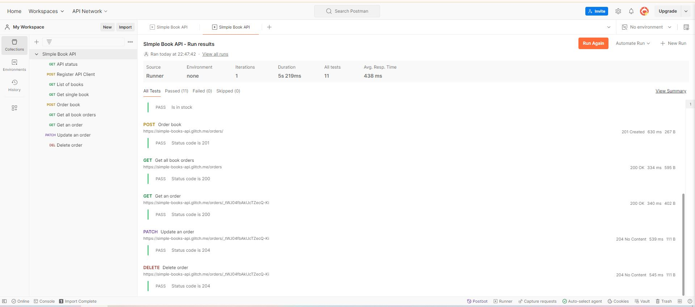

# Kiểm thử tự động với Postman 
Chúng tôi đã viết các kịch bản kiểm thử tự động với Postman thực hiện một cách tự động việc kiểm thử như những gì chúng ta đã làm thủ công ở bước trước.
Chúng tôi đã thực hiện export file Postman ra, bạn có thể download file `postman_collection_ver2.json` để thực hiện với Postman của cá nhân bạn.
Ảnh thực hiện chạy runner với Postman:

Việc thực hiện báo cáo cho các kịch bản kiểm thử tự động này được chúng tôi thực hiện bằng newman --reporters html cli, kết quả của báo cáo được chúng tôi up lên ở trong file `report.html`.